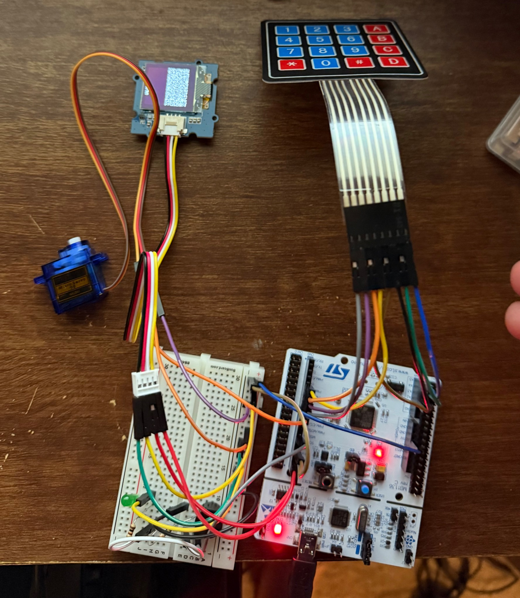

# STM32_Keypad_Lock

A basic smart lock system implemented on an STM32 Nucleo board using a 4x4 matrix keypad, servo motor, buzzer, and OLED display. This version includes full keypad-based password handling and visual/audio feedback — no RTOS required.

---

## 📦 Features

- ✅ **4x4 Matrix Keypad Input**
  - Scans keypresses via GPIO
  - Buffers input up to a defined password length
- 🔐 **Password Protection**
  - Password comparison against a stored key
  - Success = unlock + OLED + 5 beeps
  - Failure = lock + OLED + 2 beeps
  - 3 failed attempts triggers lockout with 10 buzzes and warning
- 📺 **OLED Display (SH1107 via I2C)**
  - Displays masked input (`****`)
  - Shows status: `UNLOCKED`, `ACCESS DENIED`, `LOCKED OUT`
- 🔊 **Buzzer (PWM via TIM3)**
  - Feedback tones for input and status changes
- 🔁 **Servo (PWM via TIM1)**
  - Rotates to locked/unlocked positions based on access result
- 💬 **UART Logging**
  - Debug/status messages over UART (via USART2, PA2/PA3)

---

## 🧰 Hardware Used

- STM32 Nucleo board (tested on F4 series)
- 4x4 membrane keypad
- SH1107 OLED (I2C, 128x64)
- SG90 micro servo
- Piezo buzzer (PWM-capable)
- Breadboard + jumper wires
- External 3xAA battery pack (optional for standalone power)

---

## 📸 Project Demo

Above: the full system wired up — including OLED, keypad, servo, buzzer, and STM32 Nucleo board.

---

## 🔌 GPIO Pin Mapping

| Function   | STM32 Pin | Notes                      |
|------------|-----------|----------------------------|
| OLED SDA   | PB9       | I2C1                       |
| OLED SCL   | PB8       | I2C1                       |
| Servo PWM  | TIM1_CH2  | Configurable               |
| Buzzer PWM | TIM3_CH1  | Configurable               |
| UART
